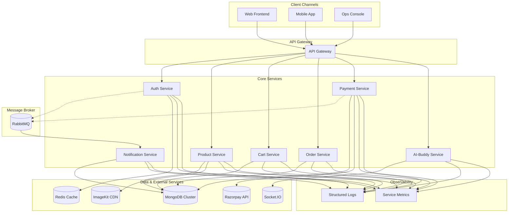

<div align="center">
  
  <h1>Super-Market Microservices Platform</h1>
  <p>
    <strong>An Enterprise-Grade, Cloud-Native Retail Commerce Suite</strong>
  </p>
  <p>
    This platform delivers a complete, modular ecosystem for modern retail operations, including services for authentication, product catalog management, shopping cart, order processing, payments, and an AI-powered assistant. It is architected for scalability, resilience, and rapid feature development.
  </p>
  <p>
    <a href="https://github.com/chittaranjan24/FSD_MAJOR_PROJECT/actions"></a>
    <a href="https://github.com/chittaranjan24/FSD_MAJOR_PROJECT/blob/main/LICENSE"></a>
    <a href="https://github.com/chittaranjan24/FSD_MAJOR_PROJECT/graphs/contributors"></a>
    <a href="https://www.linkedin.com/in/chittaranjan-shit2/"></a>
  </p>
</div>

## 🚀 Executive Overview

This project implements a distributed, microservice-based architecture tailored for omnichannel retail workloads. By decoupling critical business domains, the platform achieves superior fault isolation, independent scaling, and streamlined deployment cycles. Its event-driven, API-first design ensures that product, cart, order, and payment flows are both resilient and ready for future innovation.

### 🎯 Core Value Propositions

- **Authentication-First Security**: Hardened security posture with JWT and Redis-backed session management, providing robust user authentication and session handling.
- **AI-Powered Augmentation**: The "AI-Buddy" assistant powered by Google Gemini and LangChain enhances customer support and provides operational intelligence through real-time Socket.IO connections.
- **Developer-Centric**: Each service is a standalone Node.js application, promoting a clean and manageable development experience with clear separation of concerns.
- **Event-Driven Architecture**: Leverages RabbitMQ for asynchronous inter-service communication, ensuring loose coupling and high scalability.
- **Production-Ready Testing**: Comprehensive test coverage in the Auth service with Jest and in-memory databases, establishing patterns for enterprise-grade reliability.
- **Multi-Tenant Support**: Built-in seller dashboard service providing real-time analytics and insights for marketplace operations.


*Photography courtesy of Unsplash creators supporting open knowledge sharing.*

## ✨ Features & Capabilities

| Module | Business Outcome | Key Features |
| :--- | :--- | :--- |
|  | **Secure Identity & Access** | Resilient JWT flows, Redis-backed sessions, address book management, password encryption. |
|  | **Dynamic Product Catalogs** | CRUD operations, ImageKit-powered media delivery, seller-specific product filtering. |
|  | **Persistent Shopping Carts** | State-aware middleware, atomic cart updates, inventory-aware validation. |
|  | **Orchestrated Order Management** | End-to-end order lifecycle APIs (creation, cancellation), address mutation. |
|  | **Reliable Payment Processing** | Secure payment capture and verification via Razorpay, signature validation, audit logs. |
|  | **Automated Communications** | Event-driven email notifications for order/payment events via RabbitMQ and Nodemailer. |
|  | **Conversational AI** | Socket-based gateway for real-time conversational tooling and operational insights. |
|  | **Seller Analytics** | Provides sellers with insights into their products, orders, and payments through an event-driven dashboard. |

## 🧩 Service Topology & Responsibilities

| Service | Default Port | Critical Dependencies | Responsibilities |
| :--- | :--- | :--- | :--- |
| `auth` | 3001 | MongoDB, Redis, RabbitMQ | Identity lifecycle, token issuance and validation, address book, event emission for downstream systems. |
| `product` | 3002 | MongoDB, ImageKit, RabbitMQ | Product CRUD, media uploads, seller ownership checks, outbound catalog events. |
| `cart` | 3003 | MongoDB | Shopping cart persistence, item validation, quantity management. |
| `order` | 3004 | MongoDB, RabbitMQ, Auth/Cart/Product APIs | Order orchestration, state transitions, pricing aggregation, seller dashboard feeds. |
| `payment` | 3005 | MongoDB, Razorpay, RabbitMQ | Payment intent creation, signature verification, financial event broadcasting. |
| `ai-buddy` | 3006 | Socket.IO, LangChain, Gemini, JWT | Real-time conversational agent, operational intelligence endpoints. |
| `notification` | 3007 | RabbitMQ, Nodemailer (SMTP) | Inbox/email notifications for auth/payment/product events. |
| `seller-dashboard` | 3008 | MongoDB, RabbitMQ | Denormalised seller insights, realtime projections of orders/payments/users. |

> ℹ️ Each process is independently deployable; ensure supporting infrastructure (MongoDB, Redis, RabbitMQ, SMTP) is configured per environment before promoting releases.

## 🏗️ Solution Architecture

This platform utilizes an event-driven microservices architecture, promoting loose coupling and high scalability. Core services communicate synchronously via an API Gateway for direct client requests and asynchronously via a RabbitMQ message broker for background tasks and inter-service notifications.



## 🛠️ Technology Stack

### Backend
<p>
  
  
</p>

### AI & Machine Learning
<p>
  
  
</p>

### Database & Caching
<p>
  
  
</p>

### Messaging & Real-Time
<p>
  
  
</p>

### Testing
<p>
  
  
</p>

### Tooling & Integrations
<p>
  
  
  
  
  
  
  
  
</p>

## 📋 Prerequisites

Before you begin, ensure you have the following installed and configured:

### Required Software
- **[Node.js](https://nodejs.org/en/)**: Version 18.x or higher (LTS recommended)
- **[MongoDB](https://www.mongodb.com/try/download/community)**: Version 6.0+ (local instance or cloud cluster like MongoDB Atlas)
- **[Redis](https://redis.io/docs/getting-started/)**: Version 7.0+ for caching and session management
- **[RabbitMQ](https://www.rabbitmq.com/download.html)**: Version 3.12+ for event-driven messaging

### Development Tools
- **[Git](https://git-scm.com/)**: For version control
- **[Postman](https://www.postman.com/)** or **[Insomnia](https://insomnia.rest/)**: For API testing (optional but recommended)
- **[Docker Desktop](https://www.docker.com/products/docker-desktop/)**: For containerized infrastructure setup (optional)

### External Service Accounts
- **[Razorpay Account](https://razorpay.com/)**: For payment processing (test mode keys available)
- **[ImageKit Account](https://imagekit.io/)**: For image storage and CDN delivery
- **[Google AI Studio](https://ai.google.dev/)**: For Gemini API key (AI-Buddy service)
- **SMTP Service**: Gmail, SendGrid, or any SMTP provider for email notifications

### Quick Infrastructure Setup with Docker (Optional)
If you prefer to use Docker for infrastructure dependencies:
```bash
# MongoDB
docker run -d -p 27017:27017 --name mongodb mongo:latest

# Redis
docker run -d -p 6379:6379 --name redis redis:latest

# RabbitMQ
docker run -d -p 5672:5672 -p 15672:15672 --name rabbitmq rabbitmq:3-management
```

## 🚀 Getting Started

This project is a monorepo containing independent Node.js services. For the best development experience, run each service in its own terminal.

### ⚡ Quick Start (For Experienced Developers)

If you're familiar with microservices and have all prerequisites installed:

```bash
# 1. Clone and navigate
git clone https://github.com/chittaranjan24/FSD_MAJOR_PROJECT.git
cd FSD_MAJOR_PROJECT

# 2. Install all dependencies (run in root directory)
# Windows
for /D %d in (*) do (if exist "%d\package.json" (cd %d && npm install && cd ..))

# Unix/Linux/Mac
for dir in */; do (cd "$dir" && [ -f package.json ] && npm install); done

# 3. Configure environment variables (copy and edit .env files)
# Create .env files in each service directory based on templates below

# 4. Start infrastructure
docker-compose up -d  # If using Docker
# OR start MongoDB, Redis, RabbitMQ manually

# 5. Start all services (use separate terminals for each)
cd auth && npm run dev
cd product && npm run dev
cd cart && npm run dev
cd order && npm run dev
cd payment && npm run dev
cd notification && npm run dev
cd ai-buddy && npm run dev
cd seller-dashboard && npm run dev

# 6. Verify everything is running
# Check http://localhost:3001 through http://localhost:3008
```

### 📝 Step-by-Step Guide (Detailed)

For those new to the project or microservices, follow these detailed steps:

### 1. Clone the Repository
```bash
git clone https://github.com/chittaranjan24/FSD_MAJOR_PROJECT.git
cd FSD_MAJOR_PROJECT
```

### 2. Install Dependencies
Navigate into each service directory and install its dependencies. You can do this manually for each service or use a script.

#### Manual Installation
```bash
# Auth service
cd auth
npm install
cd ..

# Product service
cd product
npm install
cd ..

# Cart service
cd cart
npm install
cd ..

# Order service
cd order
npm install
cd ..

# Payment service
cd payment
npm install
cd ..

# Notification service
cd notification
npm install
cd ..

# AI-Buddy service
cd ai-buddy
npm install
cd ..

# Seller Dashboard service
cd seller-dashboard
npm install
cd ..
```

#### Automated Installation (Windows)
```cmd
for /D %d in (*) do (if exist "%d\package.json" (cd %d && npm install && cd ..))
```

#### Automated Installation (Unix/Linux/Mac)
```bash
for dir in */; do
  if [ -f "$dir/package.json" ]; then
    (cd "$dir" && npm install)
  fi
done
```

### 3. Configure Environment Variables
Each service requires its own `.env` file for configuration. Create a `.env` file in the root of each service directory (e.g., `auth/.env`) and populate it with the necessary credentials and endpoints.

| Service | Port | Key Environment Variables |
| :--- | :--- | :--- |
| **Auth** | 3001 | `MONGODB_URI`, `REDIS_URI`, `JWT_SECRET` |
| **Product** | 3002 | `MONGODB_URI`, `IMAGEKIT_PUBLIC_KEY`, `IMAGEKIT_PRIVATE_KEY`, `IMAGEKIT_URL_ENDPOINT` |
| **Cart** | 3003 | `MONGODB_URI` |
| **Order** | 3004 | `MONGODB_URI` |
| **Payment** | 3005 | `MONGODB_URI`, `RAZORPAY_KEY_ID`, `RAZORPAY_KEY_SECRET`, `AMQP_URL` |
| **Notification** | 3007 | `MONGODB_URI`, `AMQP_URL`, `EMAIL_HOST`, `EMAIL_PORT`, `EMAIL_USER`, `EMAIL_PASS` |
| **AI-Buddy** | 3006 | `MONGODB_URI`, `SOCKET_PORT` |
| **Seller Dashboard** | 3008 | `MONGODB_URI`, `AMQP_URL` |

#### `.env` File Templates

<details>
<summary>Click to view .env templates</summary>

**Auth Service (`auth/.env`)**
```
PORT=3001
MONGODB_URI=your_mongodb_connection_string
REDIS_URI=your_redis_connection_string
JWT_SECRET=your_super_secret_jwt_key
```

**Product Service (`product/.env`)**
```
PORT=3002
MONGODB_URI=your_mongodb_connection_string
IMAGEKIT_PUBLIC_KEY=your_imagekit_public_key
IMAGEKIT_PRIVATE_KEY=your_imagekit_private_key
IMAGEKIT_URL_ENDPOINT=your_imagekit_url_endpoint
```

**Cart Service (`cart/.env`)**
```
PORT=3003
MONGODB_URI=your_mongodb_connection_string
```

**Order Service (`order/.env`)**
```
PORT=3004
MONGODB_URI=your_mongodb_connection_string
```

**Payment Service (`payment/.env`)**
```
PORT=3005
MONGODB_URI=your_mongodb_connection_string
RAZORPAY_KEY_ID=your_razorpay_key_id
RAZORPAY_KEY_SECRET=your_razorpay_key_secret
AMQP_URL=your_rabbitmq_connection_string
```

**Notification Service (`notification/.env`)**
```
PORT=3007
MONGODB_URI=your_mongodb_connection_string
AMQP_URL=your_rabbitmq_connection_string
EMAIL_HOST=your_smtp_host
EMAIL_PORT=your_smtp_port
EMAIL_USER=your_smtp_username
EMAIL_PASS=your_smtp_password
```

**AI-Buddy Service (`ai-buddy/.env`)**
```
PORT=3006
SOCKET_PORT=4000
JWT_SECRET=your_super_secret_jwt_key
GEMINI_API_KEY=your_google_gemini_api_key
AUTH_SERVICE_URL=http://localhost:3001
PRODUCT_SERVICE_URL=http://localhost:3002
CART_SERVICE_URL=http://localhost:3003
ORDER_SERVICE_URL=http://localhost:3004
```

**Seller Dashboard Service (`seller-dashboard/.env`)**
```
PORT=3008
MONGODB_URI=your_mongodb_connection_string
AMQP_URL=your_rabbitmq_connection_string
```
</details>

### 4. Run the Services
Start each service in a separate terminal window.

#### Windows (cmd.exe)
```cmd
REM Terminal 1 - Auth Service
cd auth
npm run dev

REM Terminal 2 - Product Service
cd product
npm run dev

REM Terminal 3 - Cart Service
cd cart
npm run dev

REM Terminal 4 - Order Service
cd order
npm run dev

REM Terminal 5 - Payment Service
cd payment
npm run dev

REM Terminal 6 - Notification Service
cd notification
npm run dev

REM Terminal 7 - AI-Buddy Service
cd ai-buddy
npm run dev

REM Terminal 8 - Seller Dashboard Service
cd seller-dashboard
npm run dev
```

#### Unix/Linux/Mac
```bash
# In a new terminal, for the Auth service
cd auth
npm run dev

# In another terminal, for the Product service
cd product
npm run dev

# ... and so on for all other services
```

### 🔍 Verify Services are Running
Once all services are started, you can verify they are running by checking these endpoints:

| Service | Health Check URL | Expected Response |
| :--- | :--- | :--- |
| Auth | http://localhost:3001 | Service running message |
| Product | http://localhost:3002 | Service running message |
| Cart | http://localhost:3003 | Service running message |
| Order | http://localhost:3004 | Service running message |
| Payment | http://localhost:3005 | Service running message |
| AI-Buddy | http://localhost:3006 | Service running message |
| Notification | http://localhost:3007 | Service running message |
| Seller Dashboard | http://localhost:3008 | Service running message |
| RabbitMQ Management | http://localhost:15672 | RabbitMQ UI (guest/guest) |

### 5. Suggested Boot Order & Local Ops

1. **Bootstrap infrastructure**: ensure MongoDB, Redis, RabbitMQ, and SMTP sandboxes are reachable before starting any Node.js process.
2. **Start synchronous APIs**: launch `auth`, followed by `product`, `cart`, `order`, and `payment` so cross-service HTTP calls succeed.
3. **Start event consumers**: run `notification` and `seller-dashboard` once RabbitMQ is online to keep queues draining.
4. **Enable conversational tooling**: start `ai-buddy` after `auth` so JWT cookie verification passes during the socket handshake.
5. **Tail logs**: use `npm run dev | npx pino-pretty` (after adding Pino) or your preferred logger to confirm healthy inter-service traffic.

> 💡 Keep ports aligned with the service topology table to avoid hard-coded URL drift. Consider `.env.development` files to override ports locally without touching production credentials.

## 🔐 Configuration & Secret Management

### Environment Variables Reference

This comprehensive table lists all environment variables used across services:

| Variable | Service(s) | Required | Description | Example Value |
| :--- | :--- | :---: | :--- | :--- |
| **Server Configuration** |
| `PORT` | All | ✅ | HTTP server port | `3001` (auth), `3002` (product), etc. |
| `NODE_ENV` | All | ⚠️ | Runtime environment | `development`, `production`, `test` |
| **Database** |
| `MONGODB_URI` | Auth, Product, Cart, Order, Payment, Notification, Seller Dashboard | ✅ | MongoDB connection string | `mongodb://localhost:27017/supermarket` |
| `MONGODB_URL` | Some services (alias) | ⚠️ | Alternative MongoDB variable | `mongodb://localhost:27017/supermarket` |
| `REDIS_URI` | Auth | ✅ | Redis connection string | `redis://localhost:6379` |
| `REDIS_HOST` | Auth (alternative) | ⚠️ | Redis host | `localhost` |
| `REDIS_PORT` | Auth (alternative) | ⚠️ | Redis port | `6379` |
| **Authentication** |
| `JWT_SECRET` | Auth, Product, Cart, Order, Payment, AI-Buddy, Seller Dashboard | ✅ | Secret key for signing JWT tokens | `your_super_secret_key_min_32_chars` |
| `JWT_EXPIRES_IN` | Auth | ❌ | JWT token expiration time | `7d`, `24h`, `30m` |
| `COOKIE_MAX_AGE` | Auth | ❌ | Cookie expiration in milliseconds | `604800000` (7 days) |
| **Messaging** |
| `AMQP_URL` | Auth, Product, Payment, Notification, Seller Dashboard | ✅ | RabbitMQ connection string | `amqp://localhost:5672` |
| `RABBIT_URL` | Some services (alias) | ⚠️ | Alternative RabbitMQ variable | `amqp://localhost:5672` |
| **Payment Gateway (Razorpay)** |
| `RAZORPAY_KEY_ID` | Payment | ✅ | Razorpay API Key ID | `rzp_test_xxxxxxxxxxxx` |
| `RAZORPAY_KEY_SECRET` | Payment | ✅ | Razorpay API Key Secret | `xxxxxxxxxxxxxxxxxxxxx` |
| **Media Storage (ImageKit)** |
| `IMAGEKIT_PUBLIC_KEY` | Product | ✅ | ImageKit public key | `public_xxxxxxxxxxxx` |
| `IMAGEKIT_PRIVATE_KEY` | Product | ✅ | ImageKit private key | `private_xxxxxxxxxxxx` |
| `IMAGEKIT_URL_ENDPOINT` | Product | ✅ | ImageKit CDN endpoint | `https://ik.imagekit.io/your_id` |
| **Email (SMTP)** |
| `EMAIL_HOST` | Notification | ✅ | SMTP server host | `smtp.gmail.com` |
| `EMAIL_PORT` | Notification | ✅ | SMTP server port | `587`, `465` |
| `EMAIL_USER` | Notification | ✅ | SMTP username/email | `your-email@gmail.com` |
| `EMAIL_PASS` | Notification | ✅ | SMTP password/app password | `your-app-specific-password` |
| `EMAIL_FROM` | Notification | ❌ | Sender email address | `noreply@supermarket.com` |
| `EMAIL_SECURE` | Notification | ❌ | Use TLS/SSL | `true`, `false` |
| **AI Assistant (Google Gemini)** |
| `GEMINI_API_KEY` | AI-Buddy | ✅ | Google Gemini API key | `AIzaSyXXXXXXXXXXXXXXXXXXX` |
| `SOCKET_PORT` | AI-Buddy | ✅ | Socket.IO server port | `4000` |
| **Service URLs (for inter-service communication)** |
| `AUTH_SERVICE_URL` | AI-Buddy, Order, Payment | ⚠️ | Auth service base URL | `http://localhost:3001` |
| `PRODUCT_SERVICE_URL` | AI-Buddy, Cart, Order | ⚠️ | Product service base URL | `http://localhost:3002` |
| `CART_SERVICE_URL` | AI-Buddy, Order | ⚠️ | Cart service base URL | `http://localhost:3003` |
| `ORDER_SERVICE_URL` | AI-Buddy, Payment | ⚠️ | Order service base URL | `http://localhost:3004` |
| **CORS & Security** |
| `CORS_ORIGIN` | All | ❌ | Allowed CORS origins | `http://localhost:3000` |
| `COOKIE_DOMAIN` | Auth | ❌ | Cookie domain | `localhost`, `.example.com` |
| `COOKIE_SECURE` | Auth | ❌ | HTTPS-only cookies | `true` (production), `false` (dev) |

**Legend:**
- ✅ **Required**: Must be set for service to function
- ⚠️ **Conditional**: Required in certain configurations
- ❌ **Optional**: Has default values or not critical

### Security Best Practices

| Variable | Description | Scope |
| :--- | :--- | :--- |
| `NODE_ENV` | `development`, `staging`, `production` — toggles behaviour flags. | All services |
| `PORT` | Exposed HTTP port. Ensure uniqueness per service. | All services |
| `JWT_SECRET` | Signing key for access tokens. Rotate regularly and store in a secret manager. | auth, cart, order, payment, ai-buddy |
| `MONGODB_URI` / `MONGODB_URL` | MongoDB connection string. Prefer unique databases per bounded context. | auth, product, cart, order, payment, notification, seller-dashboard |
| `REDIS_*` | Host/port/password for session cache. | auth |
| `RABBIT_URL` / `AMQP_URL` | RabbitMQ connection string for message publishing & consuming. | auth, product, payment, notification, seller-dashboard |
| `IMAGEKIT_*` | ImageKit credentials for media uploads. | product |
| `RAZORPAY_KEY_ID`, `RAZORPAY_KEY_SECRET` | Razorpay integration keys. | payment |
| `EMAIL_*` / OAuth2 tokens | SMTP credentials for outbound notifications. | notification |
| `SOCKET_PORT` | Dedicated Socket.IO port (if split from HTTP). | ai-buddy |

### Secret Management Strategies

#### Development Environment
```bash
# Use .env files (included in .gitignore)
# Never commit .env files to version control
cp .env.example .env
# Edit .env with your local credentials
```

#### Production Environment
- **Managed Secret Stores**: Use AWS Secrets Manager, Azure Key Vault, GCP Secret Manager, or HashiCorp Vault
- **Environment Variables**: Inject secrets at runtime through your orchestration platform (Kubernetes Secrets, Docker Secrets)
- **Secret Rotation**: Automate key rotation for JWT secrets, payment credentials, and SMTP tokens
- **Access Control**: Limit secret access based on service requirements and team roles

#### Configuration Checklist
- [ ] All services have required `.env` files
- [ ] `JWT_SECRET` is identical across all services requiring authentication
- [ ] MongoDB databases are separated per service (recommended)
- [ ] RabbitMQ credentials are configured correctly
- [ ] External API keys (Razorpay, ImageKit, Gemini) are valid
- [ ] SMTP credentials are tested and working
- [ ] Production secrets are stored in secure secret manager
- [ ] `.env` files are added to `.gitignore`

## 🚢 Production Deployment Blueprint

1. **Artifact preparation**
  - Run `npm ci --omit=dev` within each service to generate deterministic installs.
  - Bundle source plus `package.json`/`package-lock.json` for immutable builds.
  - Populate environment-specific `.env` files or secret references.

2. **Runtime packaging**
  - **Docker (recommended)**: build per-service images (multi-stage) and publish to a container registry (ECR/ACR/GCR/GHCR).
  - **VM/Server**: manage processes via `pm2`, `systemd`, or Supervisor; configure log rotation and auto-restart.

3. **Infrastructure provisioning**
  - VPC/Subnets with security groups or firewall rules for service isolation.
  - Managed MongoDB, Redis, RabbitMQ instances sized for baseline and peak traffic.
  - Secret manager integration with CI/CD for environment injection.

4. **Deployment sequencing**
  1. Deploy shared infrastructure (databases, queues, secret store bindings).
  2. Roll out authentication and catalog services (`auth`, `product`).
  3. Follow with transactional APIs (`cart`, `order`, `payment`).
  4. Bring online async processors (`notification`, `seller-dashboard`).
  5. Enable `ai-buddy` after JWT issuance is live.
  6. Run smoke tests (`/api/auth/login`, `/api/products`, `/api/orders/me`).

5. **Post-deploy validation**
  - Seed admin users, sample catalog entries, and check queue backlogs.
  - Validate webhook/payment callbacks in a staging environment before production cutover.
  - Configure monitoring dashboards and alert thresholds.

## 🩺 Observability & Operations

- **Logging**: Adopt structured logging (e.g., Pino) and include correlation IDs (`X-Request-ID`) to trace cross-service flows.
- **Metrics**: Export Prometheus-compatible metrics or integrate with a hosted metrics solution to track request latency, queue depth, and payment success rate.
- **Tracing**: Instrument critical flows (register → checkout → pay) with OpenTelemetry to detect regressions quickly.
- **Health/Readiness**: Surface `/healthz` and `/readyz` endpoints with checks to MongoDB, Redis, RabbitMQ, and external APIs.
- **Alerting**: Define SLOs/SLIs (auth error rate, payment conversion) and trigger alerts when thresholds breach.

## 🛡️ Security Hardening Guide

- Enforce HTTPS and HSTS; terminate TLS at a load balancer or API gateway.
- Set `Secure`, `HttpOnly`, and `SameSite` flags on authentication cookies.
- Apply rate limiting on auth endpoints and sensitive mutation routes.
- Validate request payloads with `express-validator`/`zod` and sanitise inputs to avoid injection attacks.
- Run dependency scans (`npm audit`, Snyk) in CI; patch high-severity issues promptly.
- Implement role-based access enforcement in `order`, `product`, and dashboard contexts.
- Enable audit logging for administrative actions and finance-related events.

## 💾 Backup & Recovery Planning

- Schedule automated MongoDB snapshots (and test restores quarterly).
- Configure RabbitMQ durable queues and mirrored policies for high availability.
- Back up Redis data if session persistence is required between restarts.
- Document disaster recovery RTO/RPO targets and run tabletop exercises to validate procedures.

## 🔧 Troubleshooting Guide

### Common Issues and Solutions

#### Issue: Services fail to start
**Symptoms**: Service crashes immediately or shows connection errors

**Solutions**:
1. Check if all infrastructure dependencies are running:
   ```bash
   # Check MongoDB
   mongosh --eval "db.version()"
   
   # Check Redis
   redis-cli ping
   
   # Check RabbitMQ
   rabbitmqctl status
   ```

2. Verify environment variables in `.env` files
3. Check port conflicts: Ensure no other process is using the service ports
4. Review logs for specific error messages

#### Issue: JWT authentication fails
**Symptoms**: 401 Unauthorized errors, "Invalid token" messages

**Solutions**:
1. Ensure `JWT_SECRET` is consistent across services
2. Check if JWT cookie is being sent with requests
3. Verify Redis is running for session storage
4. Clear browser cookies and re-login
5. Check token expiration settings

#### Issue: RabbitMQ connection errors
**Symptoms**: "Connection refused" or "Queue not found" errors

**Solutions**:
1. Verify RabbitMQ is running: `rabbitmqctl status`
2. Check `AMQP_URL` in service `.env` files
3. Ensure RabbitMQ management plugin is enabled:
   ```bash
   rabbitmq-plugins enable rabbitmq_management
   ```
4. Access RabbitMQ UI at `http://localhost:15672` (guest/guest)

#### Issue: Image upload fails in Product service
**Symptoms**: Product creation succeeds but images are missing

**Solutions**:
1. Verify ImageKit credentials in `product/.env`
2. Check ImageKit API quota and limits
3. Ensure `multer` is correctly configured
4. Check file size limits and allowed formats

#### Issue: Payment verification fails
**Symptoms**: Razorpay payments complete but verification fails

**Solutions**:
1. Verify Razorpay API credentials
2. Check signature validation logic
3. Use Razorpay test mode for development
4. Ensure webhook URLs are correctly configured

#### Issue: MongoDB connection timeout
**Symptoms**: "Connection timed out" or "ECONNREFUSED" errors

**Solutions**:
1. Verify MongoDB is running
2. Check `MONGODB_URI` connection string format
3. For MongoDB Atlas, whitelist your IP address
4. Check network connectivity and firewall rules

#### Issue: Services can't communicate with each other
**Symptoms**: HTTP errors when services call each other

**Solutions**:
1. Verify all services are running on correct ports
2. Check service URLs in environment variables
3. Ensure auth middleware allows inter-service calls
4. Review CORS configuration if calling from browser

### Performance Issues

#### Slow API responses
1. Enable database query logging and optimize slow queries
2. Implement Redis caching for frequently accessed data
3. Add database indexes on frequently queried fields
4. Use pagination for large result sets

#### High memory usage
1. Check for memory leaks using Node.js profiler
2. Optimize MongoDB queries to reduce data transfer
3. Limit query result sizes
4. Configure appropriate connection pool sizes

### Debugging Tips

1. **Enable detailed logging**: Set `NODE_ENV=development` for verbose logs
2. **Use debugging tools**: 
   - VS Code debugger with `--inspect` flag
   - Chrome DevTools for Node.js debugging
3. **Monitor service health**: Create health check endpoints
4. **Database GUI tools**: Use MongoDB Compass, Redis Commander
5. **API testing**: Use Postman/Insomnia with saved collections

### Getting Additional Help

If you encounter issues not covered here:
1. Check existing [GitHub Issues](https://github.com/chittaranjan24/FSD_MAJOR_PROJECT/issues)
2. Search the codebase for similar error messages
3. Review service logs for detailed error information
4. Open a new issue with:
   - Detailed error description
   - Steps to reproduce
   - Environment details (OS, Node version, etc.)
   - Relevant log snippets

## 📊 Project Statistics

<div align="center">

| Metric | Value |
|:------:|:-----:|
| **Total Services** | 8 Microservices |
| **Lines of Code** | 10,000+ |
| **Test Coverage** | Auth: 80%+ |
| **API Endpoints** | 40+ |
| **Database Collections** | 15+ |
| **Technology Stack** | 15+ Tools |
| **Development Time** | Active |

</div>

## 🎓 Learning Resources

This project demonstrates several important concepts in modern software development:

### Architecture Patterns
- **Microservices Architecture**: Service decomposition and independence
- **Event-Driven Architecture**: Asynchronous messaging with RabbitMQ
- **CQRS Pattern**: Command Query Responsibility Segregation in seller dashboard
- **API Gateway Pattern**: Centralized API management (roadmap)

### Development Practices
- **RESTful API Design**: Standard HTTP methods and status codes
- **JWT Authentication**: Stateless authentication with cookies
- **Input Validation**: Express-validator for request validation
- **Error Handling**: Centralized error handling middleware

### DevOps & Infrastructure
- **Containerization**: Docker-ready architecture (roadmap)
- **Infrastructure as Code**: Reproducible environment setup
- **CI/CD**: Automated testing and deployment (roadmap)
- **Monitoring**: Health checks and observability (roadmap)

### Recommended Reading
- [Microservices Patterns by Chris Richardson](https://microservices.io/patterns/)
- [Building Microservices by Sam Newman](https://www.oreilly.com/library/view/building-microservices-2nd/9781492034018/)
- [Node.js Design Patterns](https://www.nodejsdesignpatterns.com/)
- [MongoDB Schema Design Best Practices](https://www.mongodb.com/developer/products/mongodb/mongodb-schema-design-best-practices/)

## 🧪 Testing Strategy

The project implements a comprehensive testing strategy to ensure reliability and code quality across all services.

### Current Test Coverage

#### Auth Service - Comprehensive Test Suite ✅
The `auth` service includes a complete test suite using **Jest** and **Supertest**, establishing a pattern for ensuring service reliability and correctness.

- **Test Files**: Located in the `auth/__tests__` directory
  - `auth.register.test.js` — User registration flows
  - `auth.login.test.js` — Authentication and token generation
  - `auth.logout.test.js` — Session termination
  - `auth.me.test.js` — User profile retrieval
  - `auth.addresses.test.js` — Address management operations

- **Testing Technologies**:
  - **Jest**: Test framework with built-in mocking and assertions
  - **Supertest**: HTTP assertion library for API testing
  - **mongodb-memory-server**: In-memory MongoDB for isolated tests
  - **ioredis-mock**: Mock Redis client for session testing

- **Test Features**:
  - ✅ In-memory databases for zero external dependencies
  - ✅ Fast and isolated test execution
  - ✅ Complete coverage of authentication flows
  - ✅ Session management testing
  - ✅ Address CRUD operation validation

#### How to Run Tests
```bash
# Navigate to the auth service directory
cd auth

# Run all tests
npm test

# Run tests in watch mode (for development)
npm run test:watch

# Run tests with coverage report
npm test -- --coverage
```

### Testing Roadmap
- [ ] Extend test coverage to Product service
- [ ] Add integration tests for Cart service
- [ ] Implement E2E tests for Order workflow
- [ ] Add contract tests for inter-service communication
- [ ] Set up CI/CD automated testing pipeline

This testing model is designed to be replicated across all microservices to achieve enterprise-grade stability and reliability.

## 📖 API Endpoints

<details>
<summary>Click to view detailed API documentation</summary>

### Auth Service (`http://localhost:3001`)

#### User Registration & Authentication
- **`POST /api/auth/register`**
  - Register a new user account
  - Body: `{ name, email, password, role }`
  - Response: User object with JWT token (set in cookie)

- **`POST /api/auth/login`**
  - Authenticate existing user
  - Body: `{ email, password }`
  - Response: User object with JWT token (set in cookie)

- **`GET /api/auth/me`**
  - Get currently authenticated user profile
  - Headers: Requires JWT cookie
  - Response: User object with profile data

- **`GET /api/auth/logout`**
  - Log out current user and invalidate session
  - Headers: Requires JWT cookie
  - Response: Success message

#### Address Management
- **`GET /api/auth/users/me/address`**
  - Get all saved addresses for current user
  - Headers: Requires JWT cookie
  - Response: Array of address objects

- **`POST /api/auth/users/me/address`**
  - Add new address to user profile
  - Headers: Requires JWT cookie
  - Body: `{ street, city, state, postalCode, country }`
  - Response: Updated user object with new address

- **`DELETE /api/auth/users/me/address/:addressId`**
  - Remove specific address from user profile
  - Headers: Requires JWT cookie
  - Response: Success message

### Product Service (`http://localhost:3002`)

#### Product Management
- **`POST /api/products/`**
  - Create a new product (seller/admin only)
  - Headers: Requires JWT cookie, Content-Type: multipart/form-data
  - Body: Form data with product fields and image file
  - Response: Created product object with ImageKit URL

- **`GET /api/products/`**
  - List all available products
  - Query params: `page`, `limit`, `category`, `minPrice`, `maxPrice`, `search`
  - Response: Paginated array of product objects

- **`GET /api/products/:id`**
  - Get detailed information about a specific product
  - Response: Product object with full details

- **`PATCH /api/products/:id`**
  - Update existing product (seller only, must own product)
  - Headers: Requires JWT cookie
  - Body: Fields to update
  - Response: Updated product object

- **`DELETE /api/products/:id`**
  - Delete a product (seller only, must own product)
  - Headers: Requires JWT cookie
  - Response: Success message

- **`GET /api/products/seller`**
  - Get all products belonging to authenticated seller
  - Headers: Requires JWT cookie
  - Response: Array of seller's products

### Cart Service (`http://localhost:3003`)

#### Shopping Cart Operations
- **`GET /api/cart`**
  - Retrieve current user's shopping cart
  - Headers: Requires JWT cookie
  - Response: Cart object with items array

- **`POST /api/cart/items`**
  - Add new item to cart or update quantity if exists
  - Headers: Requires JWT cookie
  - Body: `{ productId, quantity }`
  - Response: Updated cart object

- **`PATCH /api/cart/items/:productId`**
  - Update quantity of specific item in cart
  - Headers: Requires JWT cookie
  - Body: `{ quantity }`
  - Response: Updated cart object

- **`DELETE /api/cart/items/:productId`**
  - Remove specific item from cart
  - Headers: Requires JWT cookie
  - Response: Updated cart object

### Order Service (`http://localhost:3004`)

#### Order Management
- **`POST /api/orders/`**
  - Create new order from user's current cart
  - Headers: Requires JWT cookie
  - Body: `{ shippingAddressId, paymentMethod }`
  - Response: Created order object

- **`GET /api/orders/me`**
  - Get all orders for current user
  - Headers: Requires JWT cookie
  - Query params: `page`, `limit`, `status`
  - Response: Paginated array of order objects

- **`GET /api/orders/:id`**
  - Get detailed information about specific order
  - Headers: Requires JWT cookie
  - Response: Order object with items and status

- **`POST /api/orders/:id/cancel`**
  - Cancel an existing order (if status allows)
  - Headers: Requires JWT cookie
  - Response: Updated order object with cancelled status

- **`PATCH /api/orders/:id/address`**
  - Update shipping address for pending order
  - Headers: Requires JWT cookie
  - Body: `{ addressId }`
  - Response: Updated order object

### Payment Service (`http://localhost:3005`)

#### Payment Processing
- **`POST /api/payments/create/:orderId`**
  - Create Razorpay payment intent for order
  - Headers: Requires JWT cookie
  - Response: Razorpay order object with payment details

- **`POST /api/payments/verify`**
  - Verify Razorpay payment signature after payment
  - Headers: Requires JWT cookie
  - Body: `{ razorpay_order_id, razorpay_payment_id, razorpay_signature }`
  - Response: Payment verification status and order update

- **`GET /api/payments/:orderId`**
  - Get payment details for specific order
  - Headers: Requires JWT cookie
  - Response: Payment object with transaction details

### Seller Dashboard Service (`http://localhost:3008`)

#### Analytics & Insights
- **`GET /api/seller/dashboard`**
  - Get comprehensive seller dashboard metrics
  - Headers: Requires JWT cookie (seller role)
  - Response: Dashboard data with sales, orders, and product metrics

- **`GET /api/seller/orders`**
  - Get all orders for seller's products
  - Headers: Requires JWT cookie (seller role)
  - Query params: `page`, `limit`, `status`
  - Response: Paginated orders array

- **`GET /api/seller/products`**
  - Get seller's product inventory with analytics
  - Headers: Requires JWT cookie (seller role)
  - Response: Products with sales data

- **`GET /api/seller/payments`**
  - Get payment history for seller's orders
  - Headers: Requires JWT cookie (seller role)
  - Response: Payment transactions array

### Notification Service (`http://localhost:3007`)
This service does not expose public REST APIs. It operates as an event listener, consuming messages from RabbitMQ queues and sending email notifications via SMTP.

**Event Topics Subscribed:**
- `user.registered` — Welcome email to new users
- `order.created` — Order confirmation email
- `payment.success` — Payment receipt email
- `order.cancelled` — Order cancellation notification

### AI-Buddy Service (`http://localhost:3006`)
This service communicates over **Socket.IO** rather than REST APIs, providing real-time conversational AI features.

**Socket Events:**
- `connect` — Establish WebSocket connection with JWT authentication
- `message` — Send user query to AI assistant
- `response` — Receive AI-generated response with tool execution results
- `disconnect` — Close WebSocket connection

**AI Tools Available:**
- Product search and recommendations
- Order status checking
- Cart management assistance
- General shopping queries

</details>

### 📝 API Testing with Postman
A comprehensive Postman collection is recommended for testing all endpoints. Key testing scenarios:
1. Register a new user and login
2. Create products as a seller
3. Add items to cart as a buyer
4. Create an order from cart
5. Process payment through Razorpay
6. Check seller dashboard analytics
7. Test notification emails in dev environment

## 📁 Repository Structure

```
FSD_MAJOR_PROJECT/
│
├── auth/                           # Authentication & Authorization Service
│   ├── __tests__/                 # Jest test suites
│   │   ├── auth.addresses.test.js
│   │   ├── auth.login.test.js
│   │   ├── auth.logout.test.js
│   │   ├── auth.me.test.js
│   │   └── auth.register.test.js
│   ├── src/
│   │   ├── broker/                # RabbitMQ messaging
│   │   │   └── broker.js
│   │   ├── controllers/           # Request handlers
│   │   │   └── auth.controller.js
│   │   ├── db/                    # Database connections
│   │   │   ├── db.js             # MongoDB
│   │   │   └── redis.js          # Redis cache
│   │   ├── middlewares/           # Express middlewares
│   │   │   ├── auth.middleware.js
│   │   │   └── validator.middleware.js
│   │   ├── models/                # Mongoose schemas
│   │   │   └── user.model.js
│   │   ├── routes/                # API routes
│   │   │   └── auth.route.js
│   │   └── app.js                 # Express application
│   ├── test/
│   │   └── setup.js              # Test configuration
│   ├── jest.config.js            # Jest configuration
│   ├── package.json
│   └── server.js                 # Entry point
│
├── product/                       # Product Catalog Service
│   ├── src/
│   │   ├── broker/               # RabbitMQ messaging
│   │   │   └── broker.js
│   │   ├── controllers/          # Product CRUD operations
│   │   │   └── product.controller.js
│   │   ├── db/                   # MongoDB connection
│   │   │   └── db.js
│   │   ├── middlewares/          # Auth & validation
│   │   │   ├── auth.middleware.js
│   │   │   └── validator.middleware.js
│   │   ├── models/               # Product schema
│   │   │   └── product.model.js
│   │   ├── routes/               # Product API routes
│   │   │   └── product.route.js
│   │   ├── services/             # External services
│   │   │   └── imagekit.service.js
│   │   └── app.js
│   ├── package.json
│   └── server.js
│
├── cart/                         # Shopping Cart Service
│   ├── src/
│   │   ├── controllers/          # Cart operations
│   │   │   └── cart.controller.js
│   │   ├── db/                   # MongoDB connection
│   │   │   └── db.js
│   │   ├── middlewares/          # Auth & validation
│   │   │   ├── auth.middleware.js
│   │   │   └── validation.middleware.js
│   │   ├── models/               # Cart schema
│   │   │   └── cart.model.js
│   │   ├── routes/               # Cart API routes
│   │   │   └── cart.route.js
│   │   └── app.js
│   ├── package.json
│   └── server.js
│
├── order/                        # Order Management Service
│   ├── src/
│   │   ├── broker/              # RabbitMQ messaging
│   │   │   └── broker.js
│   │   ├── controllers/         # Order orchestration
│   │   │   └── order.controller.js
│   │   ├── db/                  # MongoDB connection
│   │   │   └── db.js
│   │   ├── middlewares/         # Auth & validation
│   │   │   ├── auth.middleware.js
│   │   │   └── validator.middleware.js
│   │   ├── models/              # Order schema
│   │   │   └── order.model.js
│   │   ├── routes/              # Order API routes
│   │   │   └── order.route.js
│   │   └── app.js
│   ├── package.json
│   └── server.js
│
├── payment/                     # Payment Processing Service
│   ├── src/
│   │   ├── broker/             # RabbitMQ messaging
│   │   │   └── broker.js
│   │   ├── controllers/        # Payment handlers
│   │   │   └── payment.controller.js
│   │   ├── db/                 # MongoDB connection
│   │   │   └── db.js
│   │   ├── middlewares/        # Auth middleware
│   │   │   └── auth.middleware.js
│   │   ├── models/             # Payment schema
│   │   │   └── payment.model.js
│   │   ├── routes/             # Payment API routes
│   │   │   └── payment.route.js
│   │   ├── services/           # Razorpay integration
│   │   │   └── razorpay.service.js
│   │   └── app.js
│   ├── package.json
│   └── server.js
│
├── notification/                # Notification Service
│   ├── src/
│   │   ├── broker/             # RabbitMQ consumer
│   │   │   ├── broker.js
│   │   │   └── listener.js
│   │   ├── email.js            # Email templates & sending
│   │   └── app.js
│   ├── package.json
│   └── server.js
│
├── ai-buddy/                    # AI-Powered Assistant Service
│   ├── src/
│   │   ├── agent/              # LangChain agent logic
│   │   │   ├── agent.js
│   │   │   └── tools.js        # AI tools & integrations
│   │   ├── sockets/            # Socket.IO server
│   │   │   └── socket.server.js
│   │   └── app.js
│   ├── package.json
│   └── server.js
│
├── seller-dashboard/            # Seller Analytics Service
│   ├── src/
│   │   ├── broker/             # RabbitMQ event listener
│   │   │   ├── broker.js
│   │   │   └── listener.js
│   │   ├── controllers/        # Dashboard endpoints
│   │   │   └── seller.controller.js
│   │   ├── db/                 # MongoDB connection
│   │   │   └── db.js
│   │   ├── middlewares/        # Auth & validation
│   │   │   ├── auth.middleware.js
│   │   │   └── validation.middleware.js
│   │   ├── models/             # Denormalized schemas
│   │   │   ├── order.model.js
│   │   │   ├── payment.model.js
│   │   │   ├── product.model.js
│   │   │   └── user.model.js
│   │   ├── routes/             # Dashboard routes
│   │   │   └── seller.route.js
│   │   └── app.js
│   ├── package.json
│   └── server.js
│
└── README.md                    # This file
```

### 📂 Service Architecture Patterns

Each service follows a consistent structure:
- **`server.js`**: Entry point that starts the HTTP server
- **`app.js`**: Express application configuration with middlewares and routes
- **`controllers/`**: Business logic and request handlers
- **`models/`**: Database schemas (Mongoose models)
- **`routes/`**: API endpoint definitions
- **`middlewares/`**: Reusable middleware functions (auth, validation)
- **`broker/`**: RabbitMQ publisher/consumer logic
- **`services/`**: External API integrations (ImageKit, Razorpay)
- **`__tests__/`**: Unit and integration tests (Jest)

## 🤝 Contributing

Contributions are what make the open-source community such an amazing place to learn, inspire, and create. Any contributions you make are **greatly appreciated**.

### How to Contribute

1.  **Fork the Project**
    ```bash
    # Click the "Fork" button at the top right of this repository
    ```

2.  **Clone Your Fork**
    ```bash
    git clone https://github.com/your-username/FSD_MAJOR_PROJECT.git
    cd FSD_MAJOR_PROJECT
    ```

3.  **Create a Feature Branch**
    ```bash
    git checkout -b feature/AmazingFeature
    ```

4.  **Make Your Changes**
    - Write clean, maintainable code
    - Follow the existing code style and patterns
    - Add tests for new features
    - Update documentation as needed

5.  **Commit Your Changes**
    ```bash
    git add .
    git commit -m 'Add some AmazingFeature'
    ```

6.  **Push to Your Fork**
    ```bash
    git push origin feature/AmazingFeature
    ```

7.  **Open a Pull Request**
    - Go to the original repository
    - Click "New Pull Request"
    - Select your fork and branch
    - Describe your changes in detail

### Contribution Guidelines

- **Code Style**: Follow existing patterns and conventions
- **Testing**: Add tests for new features and bug fixes
- **Documentation**: Update README and inline comments
- **Commits**: Write clear, descriptive commit messages
- **Issues**: Check existing issues before creating new ones
- **Pull Requests**: Keep PRs focused on a single feature or fix

### Areas for Contribution

- 🐛 **Bug Fixes**: Report and fix bugs
- ✨ **New Features**: Implement items from the roadmap
- 📝 **Documentation**: Improve README, API docs, and code comments
- 🧪 **Testing**: Expand test coverage for all services
- 🎨 **UI/UX**: Contribute to frontend development
- ⚡ **Performance**: Optimize database queries and API responses
- 🔒 **Security**: Identify and fix security vulnerabilities

## 📜 License

This project is licensed under the ISC License. See the `LICENSE` file for more information.

## 🗺️ Roadmap

### Phase 1: Core Infrastructure ✅
- [x] Microservices architecture setup
- [x] Authentication service with JWT and Redis
- [x] Product catalog with ImageKit integration
- [x] Shopping cart functionality
- [x] Order management system
- [x] Payment integration with Razorpay
- [x] Event-driven notifications via RabbitMQ
- [x] AI-powered assistant with LangChain and Gemini
- [x] Seller dashboard with real-time analytics
- [x] Comprehensive test suite for Auth service

### Phase 2: Frontend Development 🚧
- [ ] **Customer Web Application**
  - [ ] React/Next.js storefront
  - [ ] Product browsing and search
  - [ ] Shopping cart and checkout flow
  - [ ] User authentication and profile
  - [ ] Order history and tracking
  - [ ] AI chatbot integration

- [ ] **Seller Dashboard UI**
  - [ ] Product management interface
  - [ ] Sales analytics and reports
  - [ ] Order fulfillment tools
  - [ ] Inventory management

- [ ] **Admin Panel**
  - [ ] User management
  - [ ] Platform analytics
  - [ ] System monitoring

### Phase 3: Enhanced Features 📋
- [ ] **Social Authentication**
  - [ ] Google OAuth integration
  - [ ] GitHub OAuth integration
  - [ ] Facebook login

- [ ] **Advanced Search & Discovery**
  - [ ] Elasticsearch integration
  - [ ] Faceted search filters
  - [ ] AI-powered product recommendations
  - [ ] Similar product suggestions

- [ ] **Wishlist & Favorites**
  - [ ] Save products for later
  - [ ] Share wishlists
  - [ ] Price drop notifications

- [ ] **Reviews & Ratings**
  - [ ] Product review system
  - [ ] Rating aggregation
  - [ ] Review moderation

- [ ] **Inventory Management**
  - [ ] Real-time stock tracking
  - [ ] Low stock alerts
  - [ ] Automated reordering

### Phase 4: Observability & DevOps 🔍
- [ ] **Monitoring & Logging**
  - [ ] Integrate Prometheus for metrics
  - [ ] Set up Grafana dashboards
  - [ ] Implement distributed tracing (Jaeger/OpenTelemetry)
  - [ ] Centralized logging (ELK stack)

- [ ] **CI/CD Pipeline**
  - [ ] GitHub Actions workflows
  - [ ] Automated testing on PRs
  - [ ] Code quality gates (ESLint, SonarQube)
  - [ ] Automated deployment pipelines

- [ ] **Containerization**
  - [ ] Dockerfiles for all services
  - [ ] Docker Compose for local development
  - [ ] Multi-stage builds for optimization

### Phase 5: Cloud Deployment ☁️
- [ ] **Kubernetes Orchestration**
  - [ ] Helm charts for services
  - [ ] Auto-scaling configurations
  - [ ] Service mesh (Istio)
  - [ ] Ingress controllers

- [ ] **Cloud Infrastructure**
  - [ ] Terraform/Pulumi IaC
  - [ ] Multi-region deployment
  - [ ] CDN integration
  - [ ] Managed database services

### Phase 6: Scale & Performance 🚀
- [ ] **Caching Strategy**
  - [ ] Redis caching layers
  - [ ] CDN caching for static assets
  - [ ] API response caching

- [ ] **Database Optimization**
  - [ ] MongoDB sharding
  - [ ] Read replicas
  - [ ] Query optimization

- [ ] **API Gateway**
  - [ ] Unified API gateway
  - [ ] Rate limiting
  - [ ] Request throttling
  - [ ] API versioning

### Phase 7: Advanced Features 🎯
- [ ] **Mobile Applications**
  - [ ] React Native app
  - [ ] Push notifications
  - [ ] Offline mode

- [ ] **Real-time Features**
  - [ ] Live order tracking
  - [ ] Real-time inventory updates
  - [ ] Chat support

- [ ] **Analytics & BI**
  - [ ] Advanced business intelligence
  - [ ] Predictive analytics
  - [ ] Customer behavior tracking

- [ ] **Multi-vendor Support**
  - [ ] Vendor onboarding
  - [ ] Commission management
  - [ ] Vendor analytics

### Community Contributions Welcome! 🙌
We encourage contributions for any of these roadmap items. Check the [Contributing](#-contributing) section to get started!

## 🙏 Acknowledgements

### Core Technologies & Frameworks
- [Node.js](https://nodejs.org/) — JavaScript runtime for server-side development
- [Express.js](https://expressjs.com/) — Fast, minimalist web framework
- [MongoDB](https://www.mongodb.com/) — NoSQL database for flexible data storage
- [Redis](https://redis.io/) — In-memory data store for caching and sessions
- [RabbitMQ](https://www.rabbitmq.com/) — Message broker for event-driven architecture

### Payment & Media Services
- [Razorpay](https://razorpay.com/) — Payment gateway integration
- [ImageKit](https://imagekit.io/) — Image optimization and CDN delivery

### AI & Machine Learning
- [LangChain](https://www.langchain.com/) — Framework for building AI applications
- [Google Gemini](https://ai.google.dev/) — Advanced AI model for natural language processing

### Testing & Development Tools
- [Jest](https://jestjs.io/) — JavaScript testing framework
- [Supertest](https://github.com/visionmedia/supertest) — HTTP assertion library
- [Nodemon](https://nodemon.io/) — Auto-restart development server

### Community & Resources
- [Unsplash](https://unsplash.com/) — Beautiful photography and imagery
- [Shields.io](https://shields.io/) — README badges and status indicators
- [MDN Web Docs](https://developer.mozilla.org/) — Comprehensive web development documentation
- [Stack Overflow](https://stackoverflow.com/) — Developer community support

### Special Thanks
A heartfelt thank you to all the open-source maintainers whose work makes projects like this possible. Your dedication to building and sharing tools freely empowers developers worldwide to create amazing applications.

---

## 📞 Contact & Support

### Project Maintainer
- **Name**: Chittaranjan Shit
- **GitHub**: [@chittaranjan24](https://github.com/chittaranjan24)
- **LinkedIn**: [Chittaranjan Shit](https://www.linkedin.com/in/chittaranjan-shit2/)

### Get Help
- 🐛 **Report Bugs**: [Open an Issue](https://github.com/chittaranjan24/FSD_MAJOR_PROJECT/issues/new?template=bug_report.md)
- 💡 **Feature Requests**: [Suggest a Feature](https://github.com/chittaranjan24/FSD_MAJOR_PROJECT/issues/new?template=feature_request.md)
- 💬 **Discussions**: [GitHub Discussions](https://github.com/chittaranjan24/FSD_MAJOR_PROJECT/discussions)
- 📧 **Email**: Open an issue for contact information

### Connect with the Community
- ⭐ **Star this repository** if you find it helpful
- 👀 **Watch** for updates and new features
- 🍴 **Fork** to create your own version
- 🔔 **Enable notifications** to stay updated

---

<div align="center">
  <p>
    <strong>Built with ❤️ by developers, for developers</strong>
  </p>
  <p>
    <sub>If this project helped you, consider giving it a ⭐ on GitHub!</sub>
  </p>
  <p>
    <a href="#super-market-microservices-platform">Back to Top ↑</a>
  </p>
</div>
