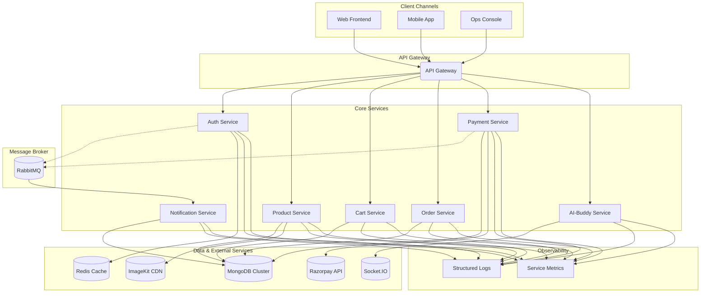

<div align="center">
  
  <h1>Super-Market Microservices Platform</h1>
  <p>
    <strong>Enterprise-Grade Retail Commerce Suite</strong> delivering modular services for authentication, catalog, cart, ordering, payments, and AI enablement.
  </p>
  <p>
    <a href="https://github.com/chittaranjan24/FSD_MAJOR_PROJECT/blob/main/LICENSE"></a>
    <a href="https://www.linkedin.com/in/chittaranjan-shit2/"></a>
  </p>
</div>

<div align="center">
  <table>
    <tr>
      <td><strong>Customers</strong><br>Personalized journeys, secure identity, and consistent cart experiences.</td>
      <td><strong>Operations</strong><br>Service isolation for streamlined deployments and fault containment.</td>
      <td><strong>Revenue</strong><br>Faster product launches, payment agility, and data-driven automation.</td>
    </tr>
  </table>
</div>

---

## Executive Overview

- Microservice topology designed for omnichannel retail workloads
- Event-ready APIs that scale independently across product, cart, order, and payment flows
- Authentication-first security posture with Redis-backed session hardening
- AI-Buddy assistant to augment customer support and operational intelligence


*Photography courtesy of Unsplash creators supporting open knowledge sharing.*

## Platform Storyboard

| Module | Business Outcome | Delivery Assets |
| --- | --- | --- |
|  | Reduce onboarding friction with resilient JWT flows and address book automation | REST APIs, Redis cache, validation middleware |
|  | Accelerate merchandizing through ImageKit powered asset delivery | CRUD controllers, media services, seller filters |
|  | Maintain live baskets with inventory-aware validation | State-aware middleware, atomic updates |
|  | Standardize order orchestration from creation to cancellation | Lifecycle APIs, address mutation endpoints |
|  | Secure capture and verification with Razorpay integration | Signature verification, transactional audit logs |
|  | Deliver timely order and payment confirmations via email | Event-driven listeners, Nodemailer integration |
|  | Deploy conversational tooling for support and insights | Socket gateway, agent toolkits, extensible adapters |

## Solution Architecture

This platform uses an event-driven microservices architecture, facilitating loose coupling and high scalability. Core services communicate synchronously via a gateway for direct client requests and asynchronously via a RabbitMQ message broker for background tasks and inter-service notifications.



## Technology Stack

### Frontend (Coming Soon)
<p>
  
</p>

### Backend
<p>
  
  
</p>

### AI & Machine Learning
<p>
  
  
</p>

### Database & Caching
<p>
  
  
</p>

### Messaging
<p>
  
  
</p>

### Testing
<p>
  
  
</p>

### Tooling & Integrations
<p>
  
  
  
  
  
  
  
  
</p>

## Capability Breakdown

- **Auth Service** secures user identities, sessions, and address books with Redis-backed tokens
- **Product Service** orchestrates catalog CRUD, media uploads, and seller segmentation
- **Cart Service** maintains active carts with policy-driven validation and adjustments
- **Order Service** governs order lifecycles, change requests, and fulfillment status
- **Payment Service** captures and verifies Razorpay transactions with signature validation.
- **Notification Service** consumes events from the message broker to send transactional emails for order confirmations and payment receipts.
- **AI-Buddy Service** powers socket-based automation and assistant experiences for the platform.

## Operating Playbook

This project is composed of independent Node.js services. Run each service in its own terminal for the best developer experience and resilience testing.

### Service Bootstrapping

1. **Install dependencies**
   ```bash
   npm install
   ```
2. **Add configuration** by creating a dedicated `.env` file per service (see matrix below).
3. **Run the service**
   ```bash
   npm run dev
   ```

| Service | Port (default) | Key Environment Variables |
| --- | --- | --- |
| Auth | 3001 | `MONGODB_URI`, `REDIS_URI`, `JWT_SECRET` |
| Product | 3002 | `MONGODB_URI`, `IMAGEKIT_PUBLIC_KEY`, `IMAGEKIT_PRIVATE_KEY`, `IMAGEKIT_URL_ENDPOINT` |
| Cart | 3003 | `MONGODB_URI` |
| Order | 3004 | `MONGODB_URI` |
| Payment | 3005 | `MONGODB_URI`, `RAZORPAY_KEY_ID`, `RAZORPAY_KEY_SECRET`, `AMQP_URL` |
| Notification | 3007 | `MONGODB_URI`, `AMQP_URL`, `EMAIL_HOST`, `EMAIL_PORT`, `EMAIL_USER`, `EMAIL_PASS` |
| AI-Buddy | 3006 (configurable) | `MONGODB_URI`, `SOCKET_PORT` |

### Environment File Templates

**Auth Service (`auth/.env`)**
```
PORT=3001
MONGODB_URI=your_mongodb_connection_string
REDIS_URI=your_redis_connection_string
JWT_SECRET=your_jwt_secret
```

**Product Service (`product/.env`)**
```
PORT=3002
MONGODB_URI=your_mongodb_connection_string
IMAGEKIT_PUBLIC_KEY=your_imagekit_public_key
IMAGEKIT_PRIVATE_KEY=your_imagekit_private_key
IMAGEKIT_URL_ENDPOINT=your_imagekit_url_endpoint
```

**Cart Service (`cart/.env`)**
```
PORT=3003
MONGODB_URI=your_mongodb_connection_string
```

**Order Service (`order/.env`)**
```
PORT=3004
MONGODB_URI=your_mongodb_connection_string
```

**Payment Service (`payment/.env`)**
```
PORT=3005
MONGODB_URI=your_mongodb_connection_string
RAZORPAY_KEY_ID=your_razorpay_key_id
RAZORPAY_KEY_SECRET=your_razorpay_key_secret
AMQP_URL=your_rabbitmq_connection_string
```

**Notification Service (`notification/.env`)**
```
PORT=3007
MONGODB_URI=your_mongodb_connection_string
AMQP_URL=your_rabbitmq_connection_string
EMAIL_HOST=your_smtp_host
EMAIL_PORT=your_smtp_port
EMAIL_USER=your_smtp_username
EMAIL_PASS=your_smtp_password
```

**AI-Buddy Service (`ai-buddy/.env`)**
```
PORT=3006
MONGODB_URI=your_mongodb_connection_string
SOCKET_PORT=4000
```

## API Surface

### Auth Service
- `POST /api/auth/register` — Register new user
- `POST /api/auth/login` — Login user
- `GET /api/auth/me` — Get current user
- `GET /api/auth/logout` — Logout user
- `GET /api/auth/users/me/address` — Get user address
- `POST /api/auth/users/me/address` — Add address
- `DELETE /api/auth/users/me/address/:addressId` — Delete address

### Product Service
- `POST /api/products/` — Create product (admin/seller, images supported)
- `GET /api/products/` — List products
- `PATCH /api/products/:id` — Update product (seller)
- `DELETE /api/products/:id` — Delete product (seller)
- `GET /api/products/seller` — List seller's products
- `GET /api/products/:id` — Get product by ID

### Cart Service
- `GET /api/cart` — Get user's cart
- `POST /api/cart/items` — Add item to cart
- `PATCH /api/cart/items/:productId` — Update cart item

### Order Service
- `POST /api/orders/` — Create order
- `GET /api/orders/me` — Get user's orders
- `POST /api/orders/:id/cancel` — Cancel order
- `GET /api/orders/:id` — Get order by ID
- `PATCH /api/orders/:id/address` — Update order address

### Payment Service
- `POST /api/payments/create/:orderId` — Create payment for order
- `POST /api/payments/verify` — Verify payment

### Notification Service
- This service has no public API endpoints. It listens to events from the message broker (RabbitMQ) to trigger email notifications.

### AI-Buddy Service
- Socket gateway and agent endpoints for conversational tooling (see service code)

## Repository Topology

```
.
├── auth/
│   ├── package.json
│   ├── server.js
│   └── src/
│       ├── app.js
│       ├── controllers/
│       ├── db/
│       ├── middlewares/
│       ├── models/
│       └── routes/
├── product/
│   ├── package.json
│   ├── server.js
│   └── src/
│       ├── app.js
│       ├── controllers/
│       ├── db/
│       ├── middlewares/
│       ├── models/
│       ├── routes/
│       └── services/
├── cart/
│   ├── package.json
│   ├── server.js
│   └── src/
│       ├── app.js
│       ├── controllers/
│       ├── db/
│       ├── middlewares/
│       ├── models/
│       └── routes/
├── order/
│   ├── package.json
│   ├── server.js
│   └── src/
│       ├── app.js
│       ├── controllers/
│       ├── db/
│       ├── middlewares/
│       ├── models/
│       └── routes/
├── payment/
│   ├── package.json
│   ├── server.js
│   └── src/
│       ├── app.js
│       ├── controllers/
│       ├── db/
│       ├── middlewares/
│       ├── models/
│       ├── routes/
│       └── services/
├── ai-buddy/
│   ├── package.json
│   ├── server.js
│   └── src/
│       ├── app.js
│       ├── agent/
│       └── sockets/
└── README.md
```

## Delivery Lifecycle

1. Fork the repository
2. Create a feature branch (`git checkout -b feature/YourFeature`)
3. Commit your changes (`git commit -m "Add YourFeature"`)
4. Push to your branch (`git push origin feature/YourFeature`)
5. Open a pull request for review

## License

This project is licensed under the ISC License.

## Roadmap

- Password reset and MFA enrollment
- Social login providers (Google, GitHub, more)
- React storefront frontend
- Inter-service messaging via RabbitMQ or Kafka
- Observability stack (OpenTelemetry, Grafana)
- CI/CD automation with quality gates

## Acknowledgements

- [Node.js](https://nodejs.org/)
- [Express.js](https://expressjs.com/)
- [MongoDB](https://www.mongodb.com/)
- [Redis](https://redis.io/)
- [Razorpay](https://razorpay.com/)
- [ImageKit](https://imagekit.io/)
- [Unsplash](https://unsplash.com/) photographers for inspirational imagery
- Open-source maintainers powering this ecosystem

## Testing Strategy

The `auth` service includes a comprehensive test suite using **Jest** and **Supertest**. This establishes a pattern for ensuring service reliability and correctness.

- **Unit & Integration Tests**: Located in the `__tests__` directory.
- **In-Memory Databases**: Uses `mongodb-memory-server` and `ioredis-mock` to run tests without external database dependencies, ensuring fast and isolated test execution.
- **Run Tests**:
  ```bash
  # Navigate to the auth service directory
  cd auth
  # Run all tests
  npm test
  ```

This testing model should be expanded across all other microservices to ensure enterprise-grade stability.
