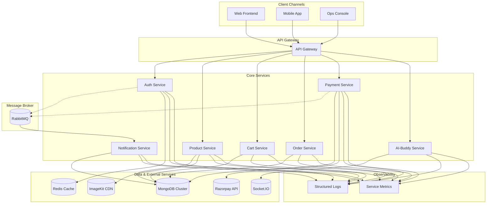

<div align="center">
  
  <h1>Super-Market Microservices Platform</h1>
  <p>
    <strong>An Enterprise-Grade, Cloud-Native Retail Commerce Suite</strong>
  </p>
  <p>
    This platform delivers a complete, modular ecosystem for modern retail operations, including services for authentication, product catalog management, shopping cart, order processing, payments, and an AI-powered assistant. It is architected for scalability, resilience, and rapid feature development.
  </p>
  <p>
    <a href="https://github.com/chittaranjan24/FSD_MAJOR_PROJECT/actions"></a>
    <a href="https://github.com/chittaranjan24/FSD_MAJOR_PROJECT/blob/main/LICENSE"></a>
    <a href="https://github.com/chittaranjan24/FSD_MAJOR_PROJECT/graphs/contributors"></a>
    <a href="https://www.linkedin.com/in/chittaranjan-shit2/"></a>
  </p>
</div>

## 🚀 Executive Overview

This project implements a distributed, microservice-based architecture tailored for omnichannel retail workloads. By decoupling critical business domains, the platform achieves superior fault isolation, independent scaling, and streamlined deployment cycles. Its event-driven, API-first design ensures that product, cart, order, and payment flows are both resilient and ready for future innovation.

- **Authentication-First Security**: Hardened security posture with JWT and Redis-backed session management.
- **AI-Powered Augmentation**: The "AI-Buddy" assistant enhances customer support and provides operational intelligence.
- **Developer-Centric**: Each service is a standalone Node.js application, promoting a clean and manageable development experience.


*Photography courtesy of Unsplash creators supporting open knowledge sharing.*

## ✨ Features & Capabilities

| Module | Business Outcome | Key Features |
| :--- | :--- | :--- |
|  | **Secure Identity & Access** | Resilient JWT flows, Redis-backed sessions, address book management, password encryption. |
|  | **Dynamic Product Catalogs** | CRUD operations, ImageKit-powered media delivery, seller-specific product filtering. |
|  | **Persistent Shopping Carts** | State-aware middleware, atomic cart updates, inventory-aware validation. |
|  | **Orchestrated Order Management** | End-to-end order lifecycle APIs (creation, cancellation), address mutation. |
|  | **Reliable Payment Processing** | Secure payment capture and verification via Razorpay, signature validation, audit logs. |
|  | **Automated Communications** | Event-driven email notifications for order/payment events via RabbitMQ and Nodemailer. |
|  | **Conversational AI** | Socket-based gateway for real-time conversational tooling and operational insights. |
|  | **Seller Analytics** | Provides sellers with insights into their products, orders, and payments through an event-driven dashboard. |

## 🧩 Service Topology & Responsibilities

| Service | Default Port | Critical Dependencies | Responsibilities |
| :--- | :--- | :--- | :--- |
| `auth` | 3001 | MongoDB, Redis, RabbitMQ | Identity lifecycle, token issuance and validation, address book, event emission for downstream systems. |
| `product` | 3002 | MongoDB, ImageKit, RabbitMQ | Product CRUD, media uploads, seller ownership checks, outbound catalog events. |
| `cart` | 3003 | MongoDB | Shopping cart persistence, item validation, quantity management. |
| `order` | 3004 | MongoDB, RabbitMQ, Auth/Cart/Product APIs | Order orchestration, state transitions, pricing aggregation, seller dashboard feeds. |
| `payment` | 3005 | MongoDB, Razorpay, RabbitMQ | Payment intent creation, signature verification, financial event broadcasting. |
| `ai-buddy` | 3006 | Socket.IO, LangChain, Gemini, JWT | Real-time conversational agent, operational intelligence endpoints. |
| `notification` | 3007 | RabbitMQ, Nodemailer (SMTP) | Inbox/email notifications for auth/payment/product events. |
| `seller-dashboard` | 3008 | MongoDB, RabbitMQ | Denormalised seller insights, realtime projections of orders/payments/users. |

> ℹ️ Each process is independently deployable; ensure supporting infrastructure (MongoDB, Redis, RabbitMQ, SMTP) is configured per environment before promoting releases.

## 🏗️ Solution Architecture

This platform utilizes an event-driven microservices architecture, promoting loose coupling and high scalability. Core services communicate synchronously via an API Gateway for direct client requests and asynchronously via a RabbitMQ message broker for background tasks and inter-service notifications.



## 🛠️ Technology Stack

### Backend
<p>
  
  
</p>

### AI & Machine Learning
<p>
  
  
</p>

### Database & Caching
<p>
  
  
</p>

### Messaging & Real-Time
<p>
  
  
</p>

### Testing
<p>
  
  
</p>

### Tooling & Integrations
<p>
  
  
  
  
  
  
  
  
</p>

## 📋 Prerequisites

Before you begin, ensure you have the following installed:
- **[Node.js](https://nodejs.org/en/)**: Version 18.x or higher
- **[MongoDB](https://www.mongodb.com/try/download/community)**: A running instance (local or cloud)
- **[Redis](https://redis.io/docs/getting-started/)**: A running instance for caching and session management
- **[RabbitMQ](https://www.rabbitmq.com/download.html)**: A running instance for event-driven messaging

## 🚀 Getting Started

This project is a monorepo containing independent Node.js services. For the best development experience, run each service in its own terminal.

### 1. Clone the Repository
```bash
git clone https://github.com/chittaranjan24/FSD_MAJOR_PROJECT.git
cd FSD_MAJOR_PROJECT
```

### 2. Install Dependencies
Navigate into each service directory and install its dependencies.

```bash
# Example for the Auth service
cd auth
npm install

# Repeat for all other services (product, cart, etc.)
```

### 3. Configure Environment Variables
Each service requires its own `.env` file for configuration. Create a `.env` file in the root of each service directory (e.g., `auth/.env`) and populate it with the necessary credentials and endpoints.

| Service | Port | Key Environment Variables |
| :--- | :--- | :--- |
| **Auth** | 3001 | `MONGODB_URI`, `REDIS_URI`, `JWT_SECRET` |
| **Product** | 3002 | `MONGODB_URI`, `IMAGEKIT_PUBLIC_KEY`, `IMAGEKIT_PRIVATE_KEY`, `IMAGEKIT_URL_ENDPOINT` |
| **Cart** | 3003 | `MONGODB_URI` |
| **Order** | 3004 | `MONGODB_URI` |
| **Payment** | 3005 | `MONGODB_URI`, `RAZORPAY_KEY_ID`, `RAZORPAY_KEY_SECRET`, `AMQP_URL` |
| **Notification** | 3007 | `MONGODB_URI`, `AMQP_URL`, `EMAIL_HOST`, `EMAIL_PORT`, `EMAIL_USER`, `EMAIL_PASS` |
| **AI-Buddy** | 3006 | `MONGODB_URI`, `SOCKET_PORT` |
| **Seller Dashboard** | 3008 | `MONGODB_URI`, `AMQP_URL` |

#### `.env` File Templates

<details>
<summary>Click to view .env templates</summary>

**Auth Service (`auth/.env`)**
```
PORT=3001
MONGODB_URI=your_mongodb_connection_string
REDIS_URI=your_redis_connection_string
JWT_SECRET=your_super_secret_jwt_key
```

**Product Service (`product/.env`)**
```
PORT=3002
MONGODB_URI=your_mongodb_connection_string
IMAGEKIT_PUBLIC_KEY=your_imagekit_public_key
IMAGEKIT_PRIVATE_KEY=your_imagekit_private_key
IMAGEKIT_URL_ENDPOINT=your_imagekit_url_endpoint
```

**Cart Service (`cart/.env`)**
```
PORT=3003
MONGODB_URI=your_mongodb_connection_string
```

**Order Service (`order/.env`)**
```
PORT=3004
MONGODB_URI=your_mongodb_connection_string
```

**Payment Service (`payment/.env`)**
```
PORT=3005
MONGODB_URI=your_mongodb_connection_string
RAZORPAY_KEY_ID=your_razorpay_key_id
RAZORPAY_KEY_SECRET=your_razorpay_key_secret
AMQP_URL=your_rabbitmq_connection_string
```

**Notification Service (`notification/.env`)**
```
PORT=3007
MONGODB_URI=your_mongodb_connection_string
AMQP_URL=your_rabbitmq_connection_string
EMAIL_HOST=your_smtp_host
EMAIL_PORT=your_smtp_port
EMAIL_USER=your_smtp_username
EMAIL_PASS=your_smtp_password
```

**AI-Buddy Service (`ai-buddy/.env`)**
```
PORT=3006
MONGODB_URI=your_mongodb_connection_string
SOCKET_PORT=4000
```

**Seller Dashboard Service (`seller-dashboard/.env`)**
```
PORT=3008
MONGODB_URI=your_mongodb_connection_string
AMQP_URL=your_rabbitmq_connection_string
```
</details>

### 4. Run the Services
Start each service in a separate terminal window.

```bash
# In a new terminal, for the Auth service
cd auth
npm run dev

# In another terminal, for the Product service
cd product
npm run dev

# ... and so on for all other services
```

### 5. Suggested Boot Order & Local Ops

1. **Bootstrap infrastructure**: ensure MongoDB, Redis, RabbitMQ, and SMTP sandboxes are reachable before starting any Node.js process.
2. **Start synchronous APIs**: launch `auth`, followed by `product`, `cart`, `order`, and `payment` so cross-service HTTP calls succeed.
3. **Start event consumers**: run `notification` and `seller-dashboard` once RabbitMQ is online to keep queues draining.
4. **Enable conversational tooling**: start `ai-buddy` after `auth` so JWT cookie verification passes during the socket handshake.
5. **Tail logs**: use `npm run dev | npx pino-pretty` (after adding Pino) or your preferred logger to confirm healthy inter-service traffic.

> 💡 Keep ports aligned with the service topology table to avoid hard-coded URL drift. Consider `.env.development` files to override ports locally without touching production credentials.

## 🔐 Configuration & Secret Management

| Variable | Description | Scope |
| :--- | :--- | :--- |
| `NODE_ENV` | `development`, `staging`, `production` — toggles behaviour flags. | All services |
| `PORT` | Exposed HTTP port. Ensure uniqueness per service. | All services |
| `JWT_SECRET` | Signing key for access tokens. Rotate regularly and store in a secret manager. | auth, cart, order, payment, ai-buddy |
| `MONGODB_URI` / `MONGODB_URL` | MongoDB connection string. Prefer unique databases per bounded context. | auth, product, cart, order, payment, notification, seller-dashboard |
| `REDIS_*` | Host/port/password for session cache. | auth |
| `RABBIT_URL` / `AMQP_URL` | RabbitMQ connection string for message publishing & consuming. | auth, product, payment, notification, seller-dashboard |
| `IMAGEKIT_*` | ImageKit credentials for media uploads. | product |
| `RAZORPAY_KEY_ID`, `RAZORPAY_KEY_SECRET` | Razorpay integration keys. | payment |
| `EMAIL_*` / OAuth2 tokens | SMTP credentials for outbound notifications. | notification |
| `SOCKET_PORT` | Dedicated Socket.IO port (if split from HTTP). | ai-buddy |

- **Secret storage**: Use managed secret stores (AWS Secrets Manager, Azure Key Vault, GCP Secret Manager) in production. Mount at runtime through your orchestrator.
- **Configuration parity**: Keep `.env.example` files in sync and document when a service expects `MONGODB_URI` vs `MONGODB_URL` to prevent deployment errors.
- **Rotation**: Automate key rotation for JWT secrets, payment credentials, and SMTP tokens; coordinate deployments to avoid outage windows.

## 🚢 Production Deployment Blueprint

1. **Artifact preparation**
  - Run `npm ci --omit=dev` within each service to generate deterministic installs.
  - Bundle source plus `package.json`/`package-lock.json` for immutable builds.
  - Populate environment-specific `.env` files or secret references.

2. **Runtime packaging**
  - **Docker (recommended)**: build per-service images (multi-stage) and publish to a container registry (ECR/ACR/GCR/GHCR).
  - **VM/Server**: manage processes via `pm2`, `systemd`, or Supervisor; configure log rotation and auto-restart.

3. **Infrastructure provisioning**
  - VPC/Subnets with security groups or firewall rules for service isolation.
  - Managed MongoDB, Redis, RabbitMQ instances sized for baseline and peak traffic.
  - Secret manager integration with CI/CD for environment injection.

4. **Deployment sequencing**
  1. Deploy shared infrastructure (databases, queues, secret store bindings).
  2. Roll out authentication and catalog services (`auth`, `product`).
  3. Follow with transactional APIs (`cart`, `order`, `payment`).
  4. Bring online async processors (`notification`, `seller-dashboard`).
  5. Enable `ai-buddy` after JWT issuance is live.
  6. Run smoke tests (`/api/auth/login`, `/api/products`, `/api/orders/me`).

5. **Post-deploy validation**
  - Seed admin users, sample catalog entries, and check queue backlogs.
  - Validate webhook/payment callbacks in a staging environment before production cutover.
  - Configure monitoring dashboards and alert thresholds.

## 🩺 Observability & Operations

- **Logging**: Adopt structured logging (e.g., Pino) and include correlation IDs (`X-Request-ID`) to trace cross-service flows.
- **Metrics**: Export Prometheus-compatible metrics or integrate with a hosted metrics solution to track request latency, queue depth, and payment success rate.
- **Tracing**: Instrument critical flows (register → checkout → pay) with OpenTelemetry to detect regressions quickly.
- **Health/Readiness**: Surface `/healthz` and `/readyz` endpoints with checks to MongoDB, Redis, RabbitMQ, and external APIs.
- **Alerting**: Define SLOs/SLIs (auth error rate, payment conversion) and trigger alerts when thresholds breach.

## 🛡️ Security Hardening Guide

- Enforce HTTPS and HSTS; terminate TLS at a load balancer or API gateway.
- Set `Secure`, `HttpOnly`, and `SameSite` flags on authentication cookies.
- Apply rate limiting on auth endpoints and sensitive mutation routes.
- Validate request payloads with `express-validator`/`zod` and sanitise inputs to avoid injection attacks.
- Run dependency scans (`npm audit`, Snyk) in CI; patch high-severity issues promptly.
- Implement role-based access enforcement in `order`, `product`, and dashboard contexts.
- Enable audit logging for administrative actions and finance-related events.

## 💾 Backup & Recovery Planning

- Schedule automated MongoDB snapshots (and test restores quarterly).
- Configure RabbitMQ durable queues and mirrored policies for high availability.
- Back up Redis data if session persistence is required between restarts.
- Document disaster recovery RTO/RPO targets and run tabletop exercises to validate procedures.

## 🧪 Testing Strategy

The `auth` service includes a comprehensive test suite using **Jest** and **Supertest**, establishing a pattern for ensuring service reliability and correctness.

- **Unit & Integration Tests**: Located in the `__tests__` directory of the `auth` service.
- **In-Memory Databases**: Uses `mongodb-memory-server` and `ioredis-mock` to run tests without external database dependencies, ensuring fast and isolated test execution.
- **How to Run Tests**:
  ```bash
  # Navigate to the auth service directory
  cd auth
  # Run all tests
  npm test
  ```
This testing model is designed to be replicated across all microservices to achieve enterprise-grade stability.

## 📖 API Endpoints

<details>
<summary>Click to view API Endpoints</summary>

### Auth Service
- `POST /api/auth/register` — Register a new user.
- `POST /api/auth/login` — Log in a user and receive a JWT.
- `GET /api/auth/me` — Get the profile of the currently authenticated user.
- `GET /api/auth/logout` — Log out the user.
- `GET /api/auth/users/me/address` — Get the user's saved addresses.
- `POST /api/auth/users/me/address` — Add a new address for the user.
- `DELETE /api/auth/users/me/address/:addressId` — Delete a specific address.

### Product Service
- `POST /api/products/` — Create a new product (admin/seller only, supports image uploads).
- `GET /api/products/` — List all available products with filtering and pagination.
- `PATCH /api/products/:id` — Update an existing product (seller only).
- `DELETE /api/products/:id` — Delete a product (seller only).
- `GET /api/products/seller` — List all products belonging to the authenticated seller.
- `GET /api/products/:id` — Get details of a single product by its ID.

### Cart Service
- `GET /api/cart` — Retrieve the contents of the user's shopping cart.
- `POST /api/cart/items` — Add a new item to the cart.
- `PATCH /api/cart/items/:productId` — Update the quantity of an item in the cart.

### Order Service
- `POST /api/orders/` — Create a new order from the user's cart.
- `GET /api/orders/me` — Get a list of the user's past orders.
- `POST /api/orders/:id/cancel` — Cancel an existing order.
- `GET /api/orders/:id` — Get details of a specific order by its ID.
- `PATCH /api/orders/:id/address` — Update the shipping address for an order.

### Payment Service
- `POST /api/payments/create/:orderId` — Create a payment intent for a specific order.
- `POST /api/payments/verify` — Verify the payment signature from Razorpay.

### Notification & AI-Buddy Services
These services do not expose public REST APIs. The Notification service listens to RabbitMQ events, and the AI-Buddy service communicates over a Socket.IO connection.

</details>

## 📁 Repository Structure

```
.
├── auth/         # Handles user identity, authentication, and authorization
├── product/      # Manages product catalog, inventory, and seller information
├── cart/         # Manages shopping cart state and logic
├── order/        # Orchestrates order creation, tracking, and fulfillment
├── payment/      # Integrates with payment gateways (Razorpay)
├── notification/ # Sends email/SMS notifications based on events
├── ai-buddy/     # Provides AI-powered assistant features
├── seller-dashboard/ # Provides analytics and insights for sellers
└── README.md
```

## 🤝 Contributing

Contributions are what make the open-source community such an amazing place to learn, inspire, and create. Any contributions you make are **greatly appreciated**.

1.  Fork the Project
2.  Create your Feature Branch (`git checkout -b feature/AmazingFeature`)
3.  Commit your Changes (`git commit -m 'Add some AmazingFeature'`)
4.  Push to the Branch (`git push origin feature/AmazingFeature`)
5.  Open a Pull Request

## 📜 License

This project is licensed under the ISC License. See the `LICENSE` file for more information.

## 🗺️ Roadmap

- [ ] **Frontend Storefront**: Develop a React-based frontend to consume the microservices.
- [ ] **Social Logins**: Implement OAuth providers like Google and GitHub in the Auth service.
- [ ] **Enhanced Observability**: Integrate a full observability stack (e.g., OpenTelemetry, Grafana, Prometheus).
- [ ] **CI/CD Automation**: Build robust CI/CD pipelines with automated testing and quality gates.
- [ ] **Containerization**: Dockerize all services and create Docker Compose configurations for easier setup.
- [ ] **Kubernetes Deployment**: Develop Helm charts for deploying the platform to a Kubernetes cluster.

## 🙏 Acknowledgements

- [Node.js](https://nodejs.org/)
- [Express.js](https://expressjs.com/)
- [MongoDB](https://www.mongodb.com/)
- [Redis](https://redis.io/)
- [RabbitMQ](https://www.rabbitmq.com/)
- [Razorpay](https://razorpay.com/)
- [ImageKit](https://imagekit.io/)
- [Unsplash](https://unsplash.com/) for the inspirational imagery.
- All the open-source maintainers whose work makes projects like this possible.
